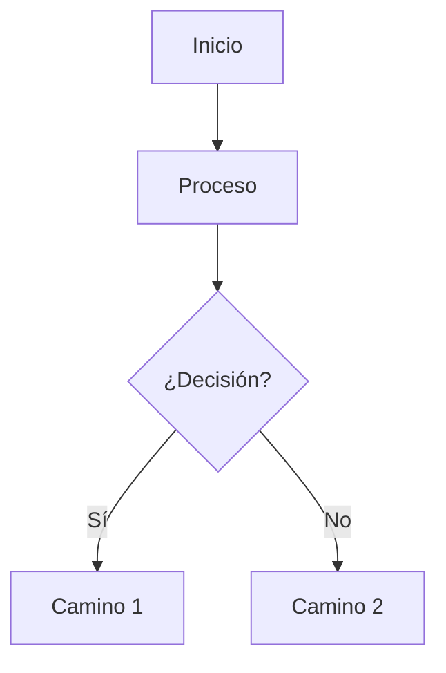
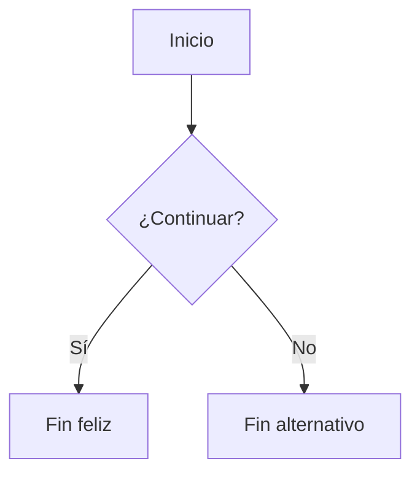

# 🌐 Guía para crear un sitio web con GitHub Pages y Jekyll

## 🧾 ¿Qué es GitHub Pages?

**GitHub Pages** es un servicio gratuito de GitHub que te permite publicar sitios web directamente desde un repositorio. Es ideal para:

- Portafolios
- Documentación
- Blogs
- Sitios personales o de proyectos

GitHub Pages puede funcionar con HTML puro o con generadores de sitios estáticos como **Jekyll**, que convierte archivos Markdown (`.md`) en sitios web automáticos con estilos, navegación y más.

---

## 🔧 ¿Qué es Jekyll?

**Jekyll** es un generador de sitios estáticos que toma tus archivos Markdown y los transforma en un sitio HTML listo para publicar.

Ventajas:

- Permite separar contenido y diseño.
- Usa temas prediseñados.
- Compatible nativamente con GitHub Pages (no necesitás compilar localmente).

---

## 🚀 ¿Cómo crear tu sitio con Jekyll y GitHub Pages?

### 1. Crear un repositorio en GitHub

- Entrá a [github.com](https://github.com)
- Hacé clic en **"New repository"**
- Poné un nombre (por ejemplo: `mi-sitio`)
- Seleccioná:
  - `Public`
  - ✅ *Initialize this repository with a README*

---

### 2. Activar GitHub Pages

1. Entrá al repositorio y hacé clic en **Settings**
2. En el menú lateral, buscá **Pages**
3. En **Source**, elegí:
   - **Branch:** `main`
   - **Folder:** `/ (root)` o `/docs` (según dónde pongas el sitio)
4. Guardá los cambios

> 🔗 El sitio se publicará en:  
> `https://tuusuario.github.io/mi-sitio/`

---

### 3. Agregar archivos del sitio

#### Estructura mínima del proyecto (si usás la raíz del repositorio):

```
mi-sitio/
├── _config.yml
├── index.md
└── README.md
```

Si elegiste usar la carpeta `/docs` en GitHub Pages, poné esos mismos archivos dentro de `/docs`:

```
mi-sitio/
└── docs/
    ├── _config.yml
    └── index.md
```

---

### 4. Crear el archivo `_config.yml`

Este archivo le dice a Jekyll cómo configurar tu sitio. Ejemplo básico:

```yaml
title: "Mi sitio con Jekyll"
theme: minima  # Podés cambiarlo por otro tema compatible
baseurl: "/mi-sitio"  # El nombre del repositorio
url: "https://tuusuario.github.io"
```

> Si tu repositorio se llama `tuusuario.github.io`, no uses `baseurl`.

---

### 5. Crear la página principal (`index.md`)

El archivo principal debe llamarse **`index.md`** o **`index.html`** para que sea reconocido como la página de inicio del sitio.

```markdown
---
layout: default
title: Bienvenido
---

# ¡Hola mundo!
Este es mi sitio usando **Jekyll** y **GitHub Pages**.
```

---

## 🎨 Cambiar el tema visual del sitio

GitHub Pages permite usar una serie de **temas compatibles sin compilar localmente**. Algunos de ellos:

- `minima` (por defecto)
- `slate`
- `cayman`
- `architect`
- `hacker`
- `dinky`

### Para cambiar el tema:

1. Abrí el archivo `_config.yml`
2. Modificá la línea del tema:

```yaml
theme: slate
```

3. Guardá y hacé un commit/push

GitHub Pages recompilará automáticamente tu sitio.

> Podés ver todos los temas disponibles en:  
> https://pages.github.com/themes/

---

## 🗂️ Crear páginas adicionales

Podés agregar más archivos Markdown, como:

- `about.md`
- `contacto.md`

Cada uno será accesible desde una URL como:

```
https://tuusuario.github.io/mi-sitio/about.html
```

### Personalizar la URL con `permalink`:

```markdown
---
layout: default
title: Sobre mí
permalink: /sobre/
---

# Sobre mí
Soy docente y programador...
```

Esto genera:

```
https://tuusuario.github.io/mi-sitio/sobre/
```

---

## 📤 Subir los cambios a GitHub

Si trabajás localmente con Git:

```bash
git add .
git commit -m "Primer versión del sitio"
git push origin main
```

---

## ✅ Resumen de buenas prácticas

- Siempre tener un `index.md` en la raíz o en `/docs`
- Usar `layout: default` (o el layout del tema) en los archivos `.md`
- Editar `_config.yml` para configurar título, tema, baseurl, etc.
- Verificá que el nombre del repositorio esté bien seteado en `baseurl`

---

## 🧪 Previsualizar localmente (opcional)

Si querés ver tu sitio antes de subirlo:

```bash
gem install bundler jekyll
jekyll new mi-sitio
cd mi-sitio
bundle exec jekyll serve
```

Accedé en `http://localhost:4000`

---

## 🧩 Recursos útiles

- [Guía oficial de GitHub Pages](https://docs.github.com/es/pages)
- [Temas disponibles en GitHub Pages](https://pages.github.com/themes/)
- [Sitio oficial de Jekyll](https://jekyllrb.com/)

---


## Notas adicionales a revisar si están en la parte superior

El archivo debe llamarse index.md

_config.yml debe estar en la raiz del proyecto

[Temas permitidos](https://pages.github.com/themes/)

La pagina:  
https://joriza.github.io/jekyll/  
Contiene otro texto que no es el del readme.md, lo que se vé en esa dirección es el contenido en index.md

---

## 🔧 Generadores soportados en GitHub Pages

### 1. **Jekyll** (soporte nativo)
- Totalmente integrado.
- No requiere acciones especiales, solo usar archivos Markdown y `_config.yml`.
- Ideal para blogs, documentación y sitios personales.

---

### 2. **Mermaid** (para diagramas)
✅ **Sí, sigue disponible** en GitHub.  
Mermaid es una librería de JavaScript que permite crear **diagramas** y **gráficos** usando sintaxis de texto plano.

#### ✅ ¿Dónde funciona?
- En **archivos `.md` directamente dentro de GitHub** (en el navegador).
- **En sitios GitHub Pages solo si se incluye manualmente la librería Mermaid.js**, ya que GitHub Pages **no la activa por defecto en Jekyll**.

#### 💡 Cómo combinar Mermaid con Jekyll en GitHub Pages

1. Agregá Mermaid desde CDN en tu plantilla/layout:

```html
<!-- En _layouts/default.html o en index.md si usás HTML -->
<script type="module">
  import mermaid from 'https://cdn.jsdelivr.net/npm/mermaid@10/dist/mermaid.esm.min.mjs';
  mermaid.initialize({ startOnLoad: true });
</script>
```

2. Usá el bloque de código así:

<pre>

</pre>

> ⚠️ En GitHub Pages, para que funcione, asegurate de que el bloque esté dentro de una página con layout HTML válido (no puro Markdown plano) y que Mermaid esté importado.

---

## 🚀 ¿Se pueden combinar Jekyll + Mermaid + otros?

¡Sí! Podés combinar:

| Tecnología | ¿Compatible? | ¿Requiere configuración extra? |
|------------|--------------|-------------------------------|
| **Jekyll** | ✅ Nativo     | No                            |
| **Mermaid**| ✅ Sí         | Sí, incluir el script         |
| **Bootstrap/Tailwind** | ✅ Sí | Sí, incluir las librerías en tu layout |
| **MathJax (LaTeX)** | ✅ Sí | Ideal para fórmulas matemáticas |
| **JavaScript personalizado** | ✅ Sí | Podés agregar scripts propios |

---

## 🧪 Ejemplo completo

```markdown
---
layout: default
title: Diagrama con Mermaid
---

# Diagrama de ejemplo


```

Asegurate de que `default.html` tenga el script de Mermaid cargado como se explicó antes.

---

¿Querés que te arme una plantilla de ejemplo que combine **Jekyll + Mermaid** lista para usar?